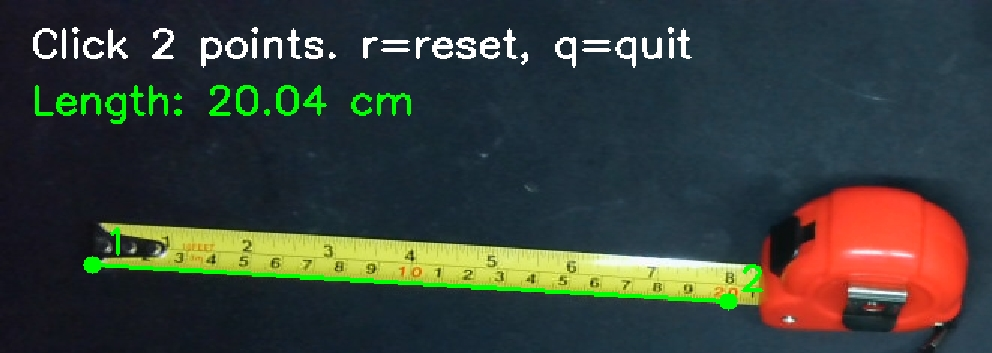

# Калибровка камеры и измерения длинны объекта(см)
## Описание:
Этот проект представляет собой инструмент компьютерного зрения для калибровки камеры и последующего измерения расстояний и длин объектов в реальных единицах (сантиметрах). На этапе настройки выполняется точная калибровка камеры с использованием шахматной доски, вычисляются внутренние параметры камеры и привязка рабочей плоскости в пространстве. После фиксации положения камеры система позволяет без использования калибровочного шаблона измерять длину произвольных объектов, лежащих в заданной плоскости, путём пересечения лучей камеры с этой плоскостью. Решение ориентировано на прикладные и производственные сценарии, где требуется воспроизводимая метрология с одной камеры при жёстко зафиксированной геометрии сцены.

Данный инструментарий включает следующие компоненты:

1. **Модуль калибровки камеры**, предназначенный для вычисления внутренних параметров и коррекции искажений на основе серии калибровочных изображений.
2. **Модуль измерения линейных размеров с использованием шахматной доски**, позволяющий определять реальные размеры объектов в сантиметрах за счёт привязки изображения к известному калибровочному шаблону.
3. **Модуль измерения линейных размеров без применения шахматной доски**, основанный на предварительной калибровке и фиксации рабочей плоскости, что обеспечивает определение размеров объектов в реальных единицах при неизменном положении камеры.

## Зависимости 

- Python 3.6+
- OpenCV 4.5+
- NumPy 1.20+
- Matplotlib 3.4+

Установите необходимые пакеты:
```bash
pip install -r requirements.txt
```
Или используйте *environment.yml*.

## Использование
Перед использованием алгоритмов необходимо скорректировать параметр `SQUARE_SIZE_CM` в соответствии с реальным размером клетки шахматной доски (на экране или в распечатанном варианте) в следующих скриптах: `calibrate_plane_once.py`, `measure_on_board.py`, `camera_calibration.py`. 
### Шаг 1. Сфотографируйте для калибровки
Вам понадобится несколько изображений шахматной доски, снятых под разными углами и с разных ракурсов. 
Скрипт `capture_calibration_images.py`в папке `calibrate_step` поможет вам сделать эти снимки:
```bash
python capture_calibration_images.py
```
Управления:
- Нажмите `c`, чтобы сделать снимок
- Нажмите `q` или Escape для выхода
### Шаг 2. Запустите калибровку камеры
Обработайте калибровочные изображения для вычисления матрицы камеры и коэффициентов искажения:
```bash
python camera_calibration.py
```
Результаты калибровки будут сохранены в каталоге `output`:
- `calibration_data.pkl`: Полные данные калибровки в формате pickle.
- `camera_matrix.txt`: Матрица камеры в текстовом формате.
- `distortion_coefficients.txt`: Коэффициенты искажения в текстовом формате.
Неискаженные версии калибровочных изображений (если они включены).
#### Далее требуется определить, какой подход использовать: решение с привязкой к шахматной доске (шаг 3) либо альтернативное решение без использования шахматной доски, основанное на фиксированной рабочей плоскости (шаг 4).
### Шаг 3. Решение с привязкой к шахматной доске.
Сначала необходимо получить тестовое изображение с помощью скрипта `capture_test_image.py` в ветке `chess_resolve`, на котором одновременно присутствуют шахматная доска и объект, предназначенный для измерения. Результат работы алгоритма является изображение `test.jpg`, которое будет задействоваться далее в скрипте `measure_on_board.py`.
Запуск алгоритма предполагает выбор двух крайних точек измеряемого объекта, по которым вычисляется его длина, возвращаемая в результате работы в виде параметра `length`.
### Шаг 4. Альтернативное решение без использования шахматной доски, основанное на фиксированной рабочей плоскости.
Необходимо перейти в ветку `position_resolve` и запустить алгоритм `calibrate_plane_once.py`, который ожидает изображение с камеры, на котором присутствует шахматная доска, для определения рабочей плоскости и формирования файла `plane_pose.pkl`. После завершения этого этапа камера должна оставаться строго зафиксированной, так как любое её смещение приведёт к нарушению корректности плоскости. Получив файл `plane_pose.pkl`, вы сможете выполнять измерение длины объектов в реальном времени с использованием алгоритма `measure_on_fixed_plane.py`.

Управления:
- Нажмите `r`, чтобы перезапутить точки измерения
- Нажмите `q` для выхода

Результат работы:

